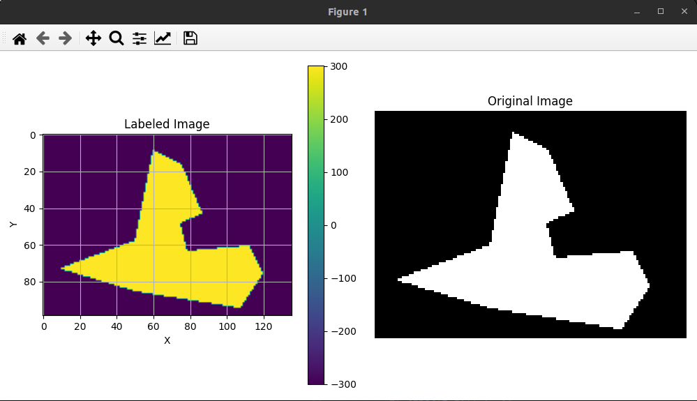
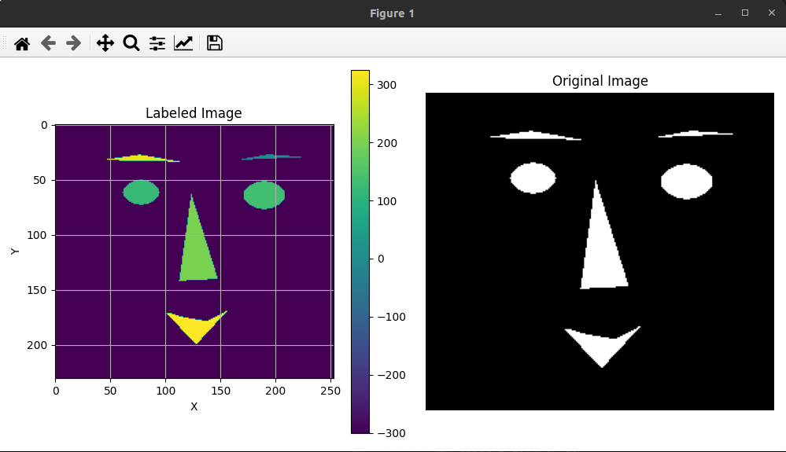
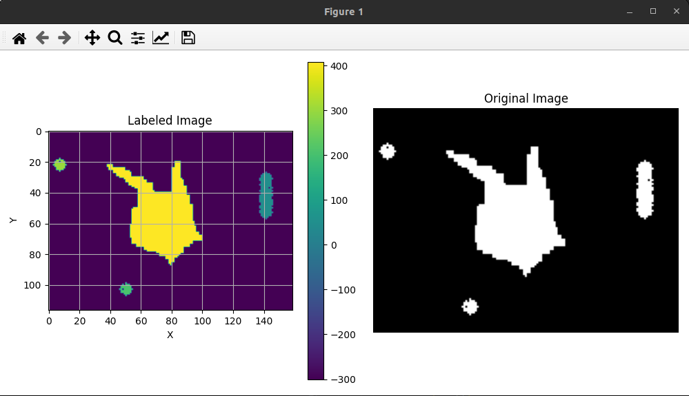
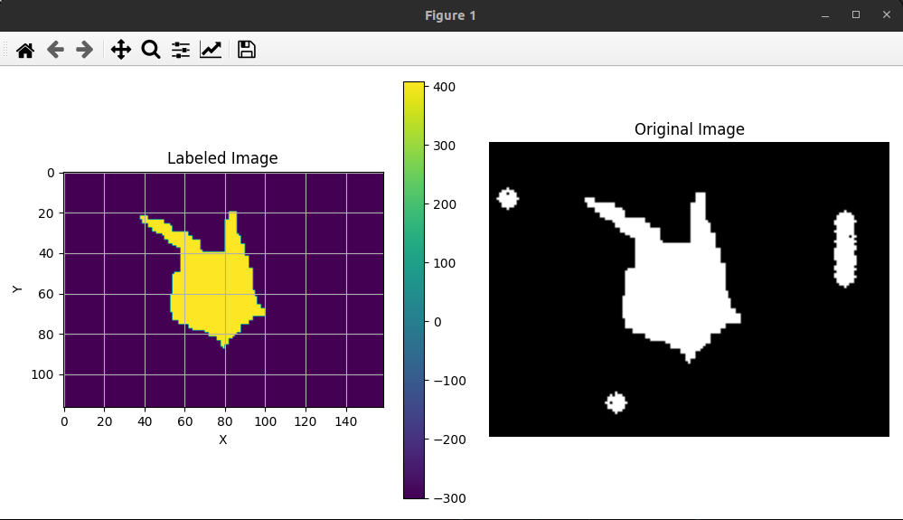

# Writeup for Homework 1

### Overview
The objective of this MP was to perform the first task of image manipulation, which is connected component labeling. This task is executed using a sequential algorithm, which can also be implemented using "breadth-first search" or "depth-first search". Here, the image is considered to be a large grid, with each grid representing the image data at that point. Typically, the data at each point is in the form [r, g, b, a], where each number ranges between [0, 255] and represents the color density at that location. The images are formatted as ".bmp", where the image data represents either white [255, 255, 255, 255] or black [0, 0, 0, 255].

### Packages Used
- Matplotlib: for plotting and reading images
- NumPy: for image array manipulation

### Algorithm
The algorithm follows a basic breadth-first search approach, iterating over the image one row at a time. The "label" array in the algorithm keeps track of background and foreground. If the image data at a point represents black, the label value is set to 0. As soon as the first "white" pixel is found, it is labeled using a counter variable (initialized as 1). If the next pixel is also foreground, the algorithm checks its four neighbors (top, bottom, right, left). If any neighbor is labeled, the label of that point is set equal to the label of the labeled neighbor. If two or more neighbors are labeled, the algorithm selects the minimum label among them for the new point. The counter variable is then incremented when the selected cell is foreground and its neighboring cells are either unmarked or background.

In the next part of the algorithm, the segments are merged. The algorithm revisits the image and examines the 8-grid neighbors around each pixel. It assigns the smallest value among all neighbor values to the selected pixel. This process continues until all segments are labeled with the same number.

*Filtering*: Filtering is applied to remove noisy outlier patches. This is accomplished by evaluating the number of labels for a segment and removing noisy segments using a thresholding value of count. For example, in the case of the gun example, a threshold value of 230 was used. While this threshold may vary for different images, it serves as a user-defined parameter for filtering purposes.

### Result

1. test.bmp segmentation 

2. face.bmp segmentation

3. gun.bmp segmentation

4. gun.bmp filtered (Removed Noise)
