# Writeup for Homework 2 - Morphological Operators

### Overview

The objective of this MP is to understand morphological operations for image processing. The algorithms implemented here include erosion, dilation, closing, opening, and boundary extraction. Here, the image is in .bmp format, so the process involves iterating through each pixel of the picture and performing the morphology tasks.

### Packages Used
- Matplotlib: for plotting and reading images
- NumPy: for image array manipulation

### Algorithms

*Dilation* - For dilation, the algorithm traverses every pixel of the image. Whenever it encounters a foreground or white pixel, it sets the neighboring pixels to white as well. The number of neighboring pixels affected is determined by the structuring element size, which can be set up while calling the function. The two loops iterate from kernel_size/2 to image_size-kernel_size/2 to handle all boundary conditions. This process effectively expands the white regions in the image, making the image thicker.

*Erosion* - For erosion, the algorithm traverses every pixel in the image. It checks all the pixels in a grid (defined by the structuring element) around the specified pixel and verifies if any of them are foreground. If true, it retains the specified pixel as foreground; otherwise, it sets the pixel to background. The two loops iterate from kernel_size/2 to image_size-kernel_size/2 to handle all boundary conditions. This process effectively shrinks the white regions in the image, removing small protrusions and thinning the image.

*Closing* - The closing algorithm combines dilation followed by erosion. It is used to close up holes in the image and help smooth the boundary. The algorithm first applies dilation with the specified kernel size and then performs erosion with the same kernel size. This removes small holes and gaps in the image.

*Opening* - The opening algorithm is the inverse of closing, performed by erosion first and then dilation. It is used to remove noise from the background while preserving larger clusters of foreground in the image. The algorithm first applies erosion with the specified kernel size and then performs dilation with the same kernel size.

*Boundary Extraction* - The boundary extraction algorithm is used to extract the boundary of all objects in the image. The algorithm iterates over each pixel of the image and checks if the pixel is foreground and if any of the neighbors are background. If true, the algorithm identifies it as a boundary and sets the pixel to foreground. Otherwise, it identifies the pixel as inside the object and sets it to background. This change highlights the boundary pixels as foreground and sets all others to background. This extraction is usually performed on a closed image to obtain a clear boundary. To achieve this closure, all the above morphology functions are used as needed.

### Results

1. Dilation, Erosion, Closing and Opening of palm with SE size (3x3)
- Dilation
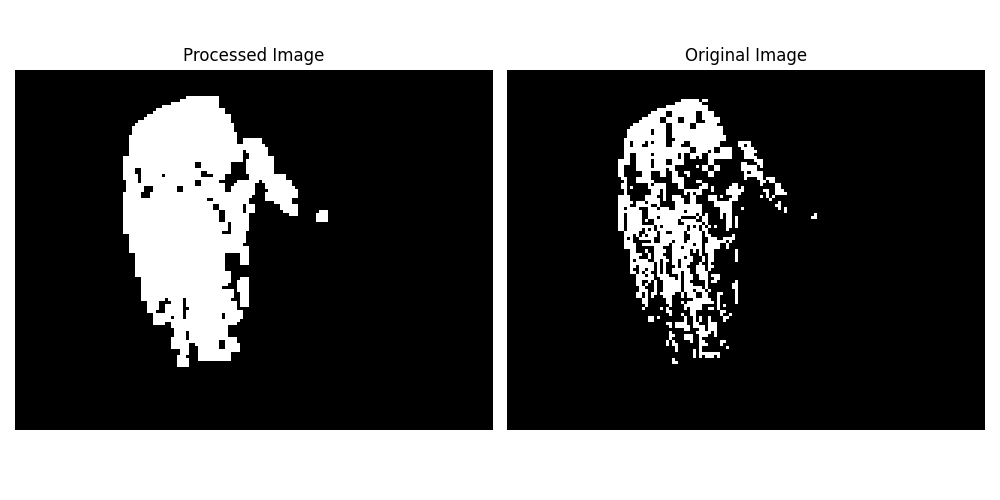
- Erosion

- Close
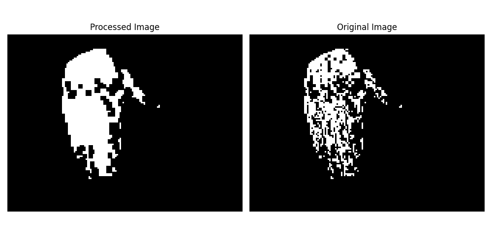
- Open
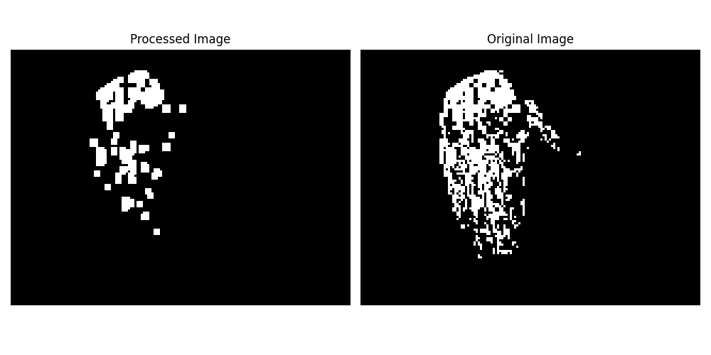

2. Dilation, Erosion, Closing and Opening of palm with SE size (5x5)
- Dilation
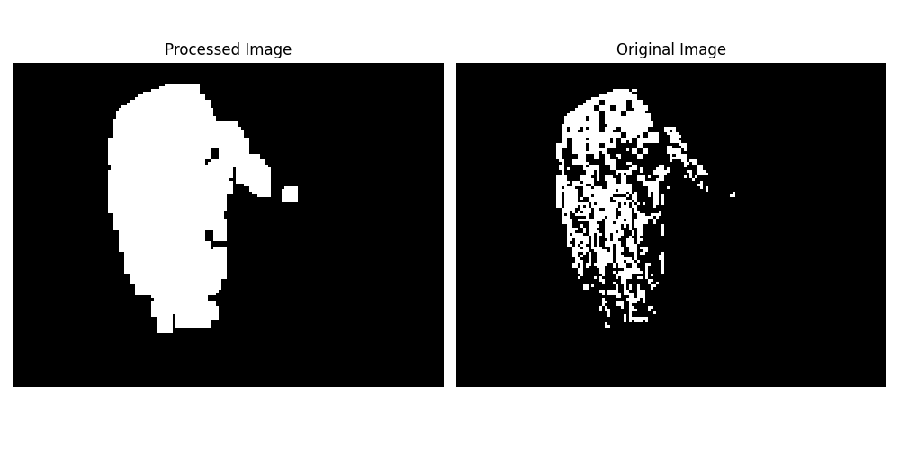
- Erosion
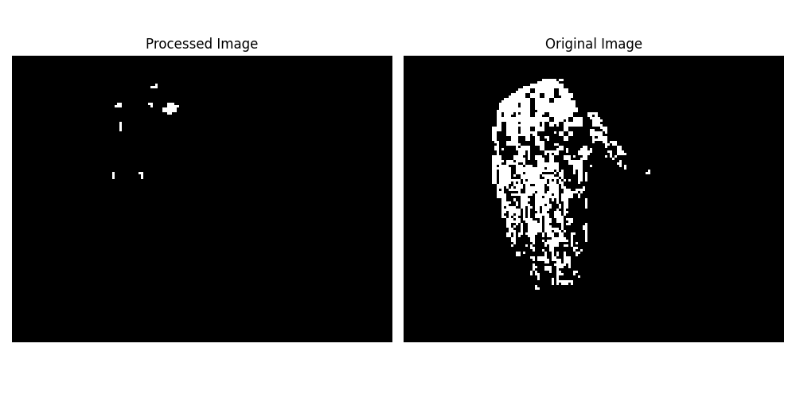
- Close
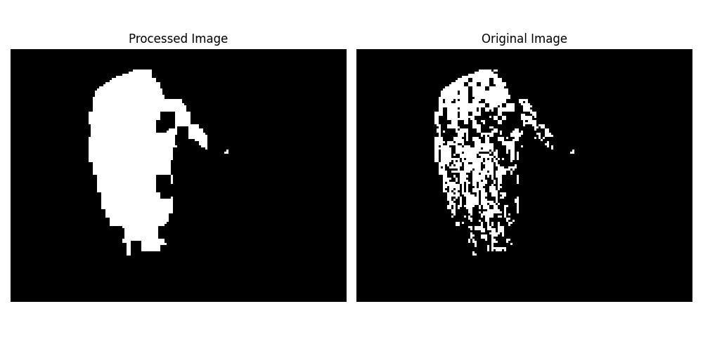
- Open
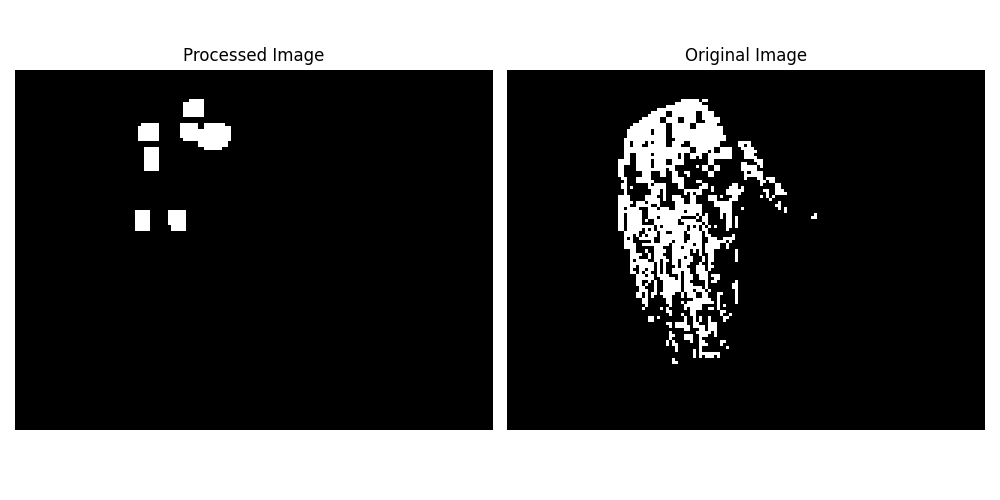

3. Dilation, Erosion, Closing and Opening of gun with SE size (3x3)
- Dilation
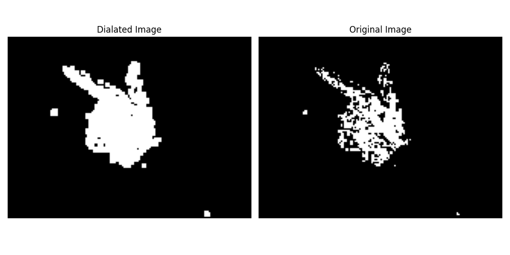
- Erosion

- Close
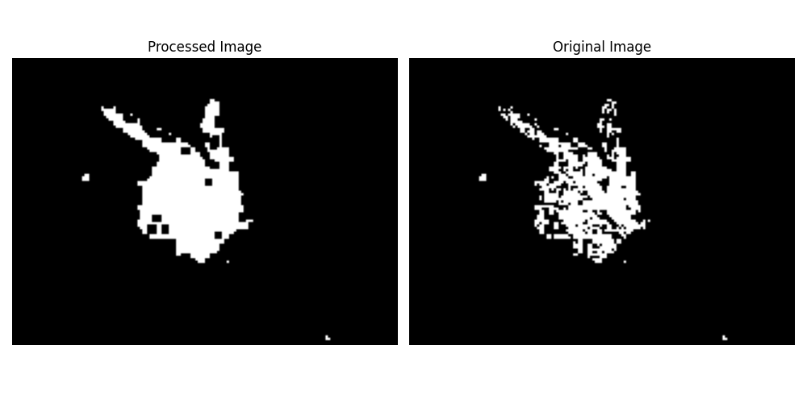
- Open
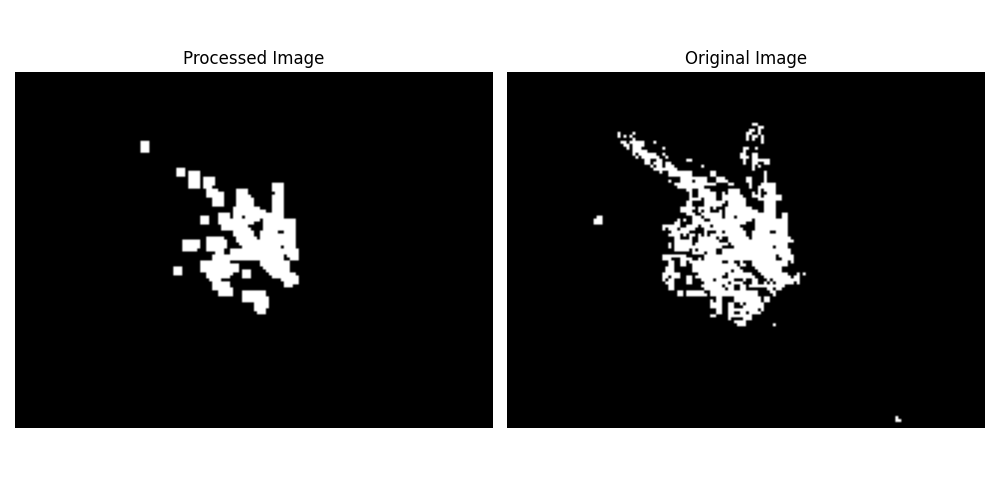

4. Dilation, Erosion, Closing and Opening of palm with SE size (5x5)
- Dilation
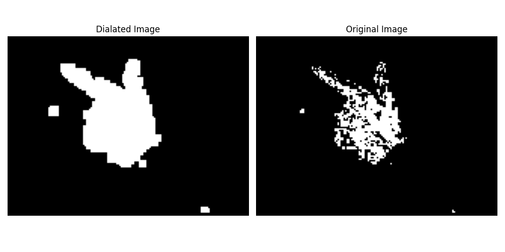
- Erosion
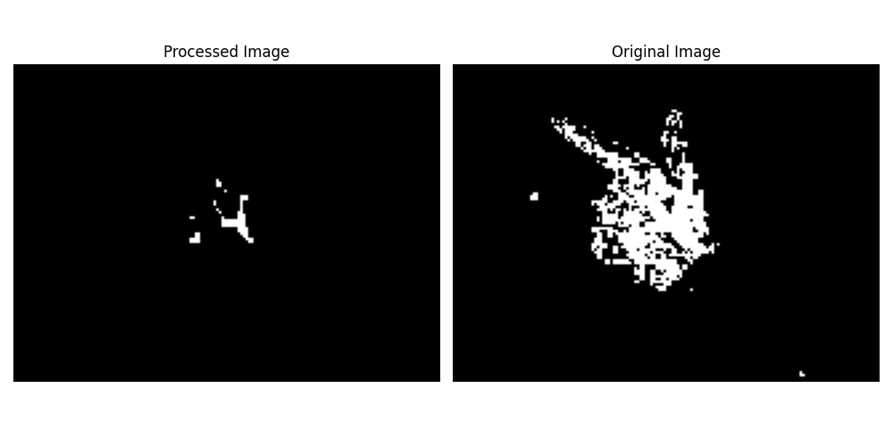
- Close
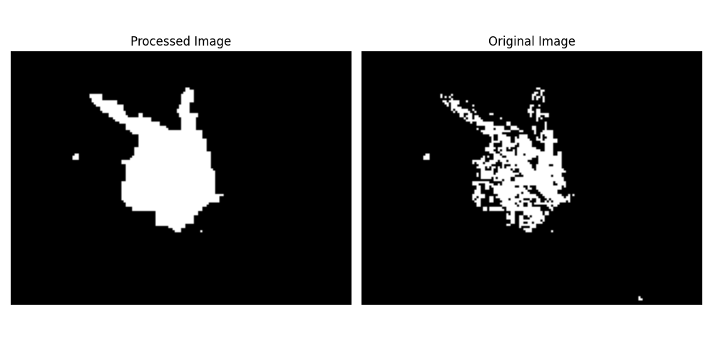
- Open
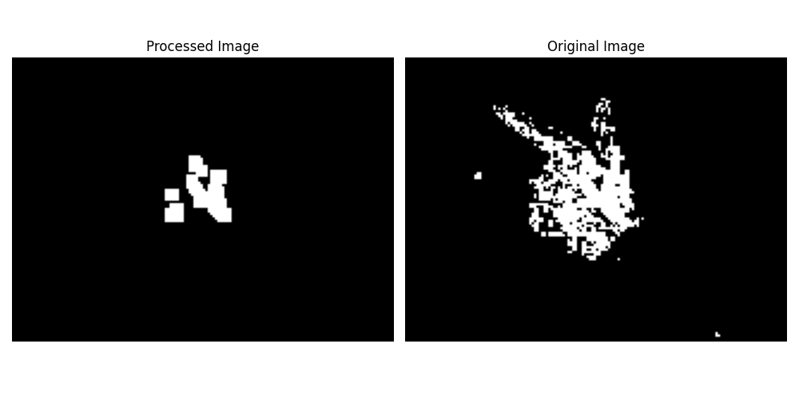

5. Boundary Extraction - Palm Image

- The image pre-processing before boundary extraction was done using the following steps:
    - Dilation using 5x5 SE
    - 3 x Dilation using 3x3 SE
    - Close using 3x3 SE
    - 2 x Dilation using 5x5 SE
    - Open using 3x3 SE

After these steps Boundary was extracted and the result is as follows:

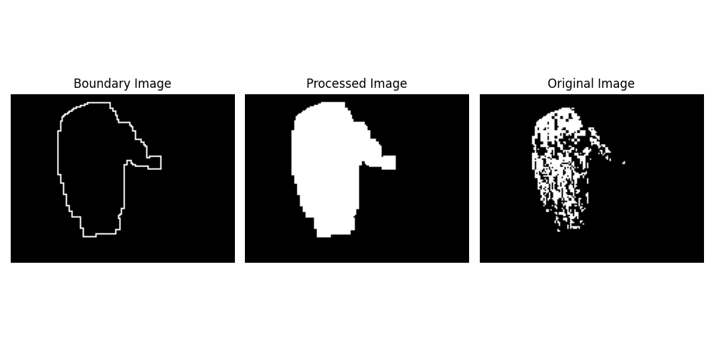

6. Boundary Extraction - Gun Image

- The image pre-processing before boundary extraction was done using the following steps:
    - Dilation using 5x5 SE
    - Erosion using 5x5 SE
    - Close using 3x3 SE
    - Open using 3x3 SE
    - Close using 3x3 SE
    - Dilation using 3x3 SE
    - Dilation using 2x2 SE
    - Close using 5x5 SE

After these steps Boundary was extracted and the result is as follows:

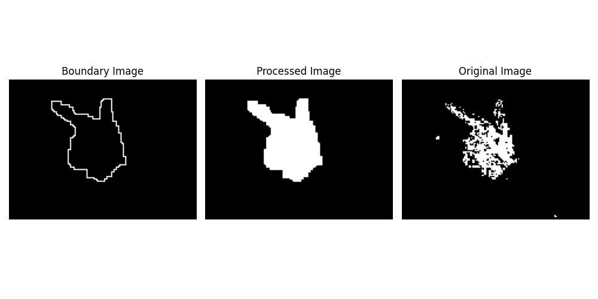

### Result Analysis

The resulting boundary images took some image pre-processing but did reach an optimal quality. The boundary on both images traces the general area of how the image should look if closed properly.

For erosion and dilation, using different SE was very important. Different SE sizes lead to very different images which can be seen in the images above. Dilation was very effective for the palm as it inflated the image enough to close some big regions which closing alone couldn't achieve. Choosing the right size of SE is very important for the task at hand. 

For closing, I could definitely see a lot of holes being filled up for both the test images. Closing alone cannot smotthen the image but it is very effective in filling up holes and creating a closed image.

For opening, it could be seen that opening alone focuses on large clusters of foreground pixels and focus on them, this function helped a lot removeing noise and outliers specially for the gun example.

