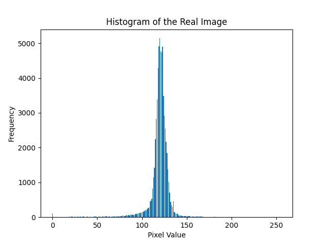
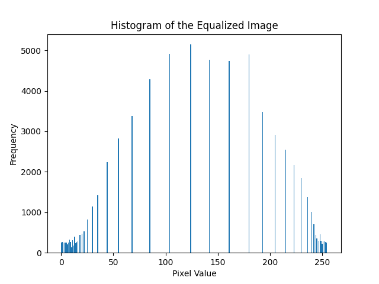
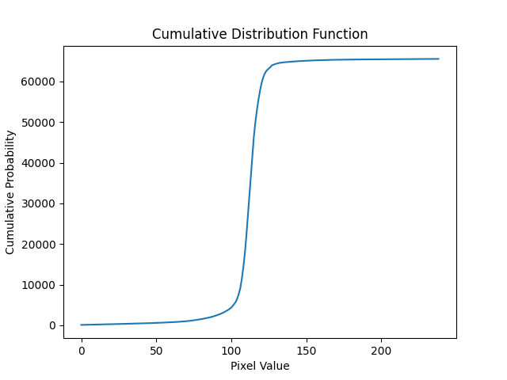
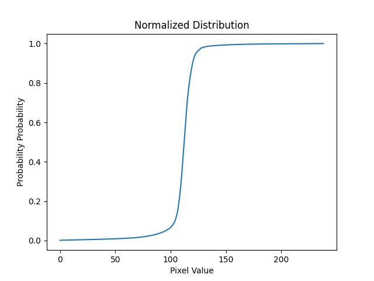
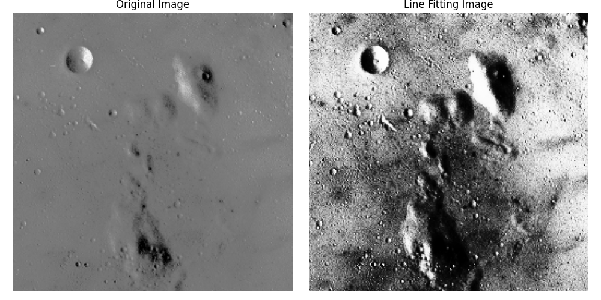
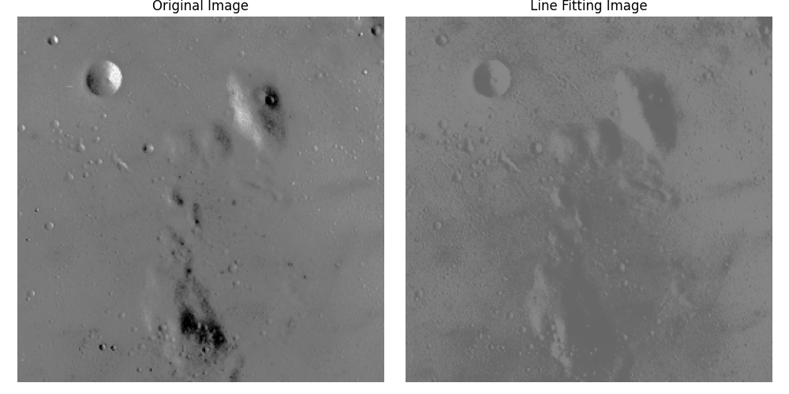
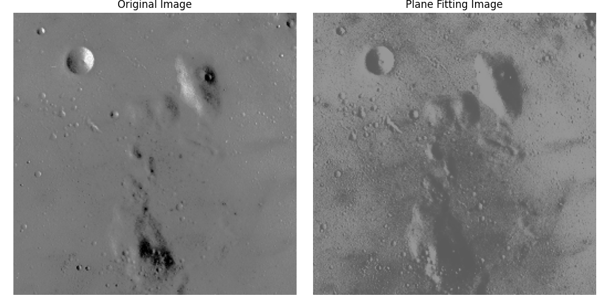
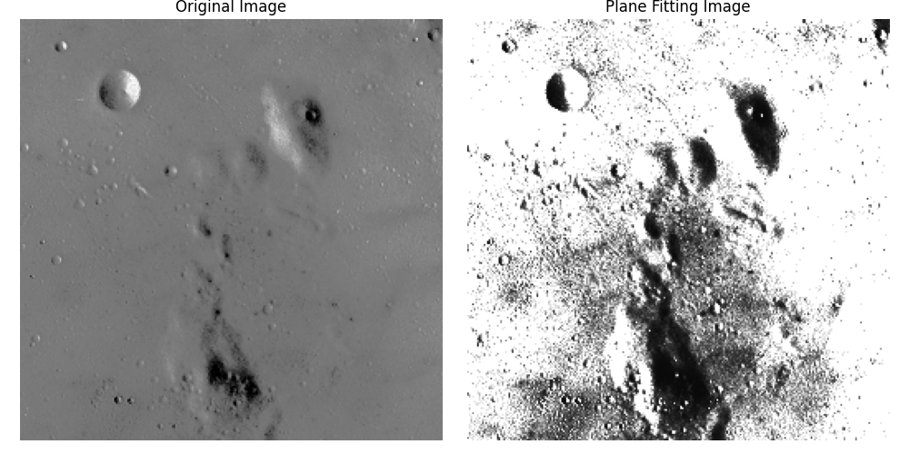

# Writeup for Image Processing Project

## Overview

The objective of this project is to implement various image processing techniques, including histogram equalization, line fitting, and plane fitting, to enhance and analyze images. The provided code processes an image of the moon using these techniques and visualizes the results.

## Packages Used
- NumPy: for numerical operations and array manipulation
- Matplotlib: for plotting histograms and displaying images

## Algorithms

### Histogram Equilization
Histogram Equilization is an image enhancement technique that is aimed at improving the constrast of the image by distributing the pixel intensity value. the algorith has following steps:
- *Computing histogram* - The histogram function takes in the image and then creates a dictionary histogram data where it associates every count of pixel intensity to the intensity value.
- *Cumulative distribution*- This function allows to create a cumulative distribution of the intensities which will be used for image smoothning
- *Normalize distribution* - this function convers the value distribution to a probability between [0,1]
- *Equalized Image Functionality* - This function iterates over every pixel of the image, checking the intensity value of each. It then equalizes the intensity by finding the probability of that intensity from the normalized distribution. This probability is then multiplied by 255 to convert it back to intensity, which is then set as the intensity of the new image. TThis functionality enables the image to be cleaned up by leveraging a distribution of its intensity values.

Here are the histogram and distribution results:

1. **Histogram of the Real Image**:
   - This histogram shows the frequency distribution of pixel intensities in the original image.

   

2. **Histogram of the Equalized Image**:
   - After histogram equalization, the histogram of the equalized image demonstrates improved contrast compared to the original image.

   

3. **Cumulative distribution Graph**
    - This is the cumulative distributuon of the Equalized image histogram

    

4. **Normalized distribution graph**
    - This is the normalized distribution of cumulative distribution

    

5. **Equilized Image**
    - This is the final image representation of the equilized image using the above results. The image macthes the result shown in slide. It enhances the features in the piture for visualization.

    

### Line Fitting Algorithm
The `line_fitting` function applies line fitting to the histogram of pixel intensities in the equalized image. It first flattens the equalized image into a 1D array of pixel intensities and constructs a design matrix `A` with each row representing a pixel intensity value. It then solves a linear equation `A * [m, c] = t`, where `m` and `c` are the slope and intercept of the fitted line, respectively, and `t` is the vector of pixel intensity values. The resulting line represents the best-fitting linear model for the distribution of pixel intensities, providing insights into the contrast enhancement achieved through histogram equalization. This line equation was then taken to fit the intensities to get line fir intensities. 

The Line Fitting Result:
A line is fitted to the histogram of the equalized image, providing insights into the distribution and contrast enhancement.

- Line fitting using mean - I also tried a more scaled version where I tried to change the intensities by subtracting the mean of densities and dividing by the std deviation. This gave a slighly cleaner image. 

The image shows the reult where we can see a difference in lightning.

### Plane Fitting Algorithm
The `plane_fitting` function extends the concept of line fitting to two dimensions, aiming to approximate the distribution of pixel intensities in the equalized image using a plane equation. It constructs a matrix `A` with each row representing a pixel location `(x, y)` and contains the coordinates along with a constant term. Additionally, it constructs a vector `I` containing the pixel intensities. The algorithm then solves the linear equation `A * [a, b, c] = I` using the numpy pseudo-inverse functionality to obtain the coefficients `a`, `b`, and `c` of the plane equation `z = a*x + b*y + c`, where `z` represents the pixel intensity. The resulting plane provides a comprehensive representation of the distribution of pixel intensities in the image, capturing both global trends and local variations. The obtained equation was then used to find the updated image.

The Plane Fitting Result: Plane fitting is applied to the equalized image to represent the distribution of pixel intensities.

- Plane fitting Scaled - I tried the plane fitting using the `A = [x^2 y^2 xy x y 1]` for the scaled method but didnt get a right image out of it. The result is attached to receive feedback on what I could have done better

The reult here seems wrong but I felt that it gives an insight into what can different approaches lead to. I want to understand this in more detail.

## Result Analysis

The image analyses for each graph is next to the associated image. The one thing I want to focus on is the plane fitting where I am not sure why the reults look soo different than expected.