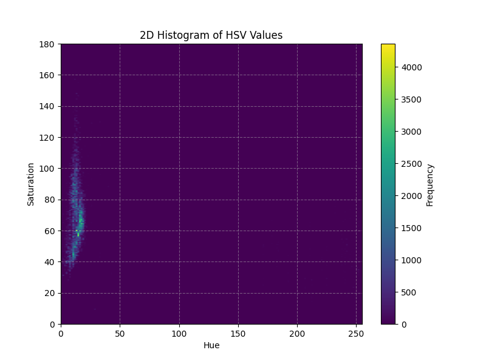
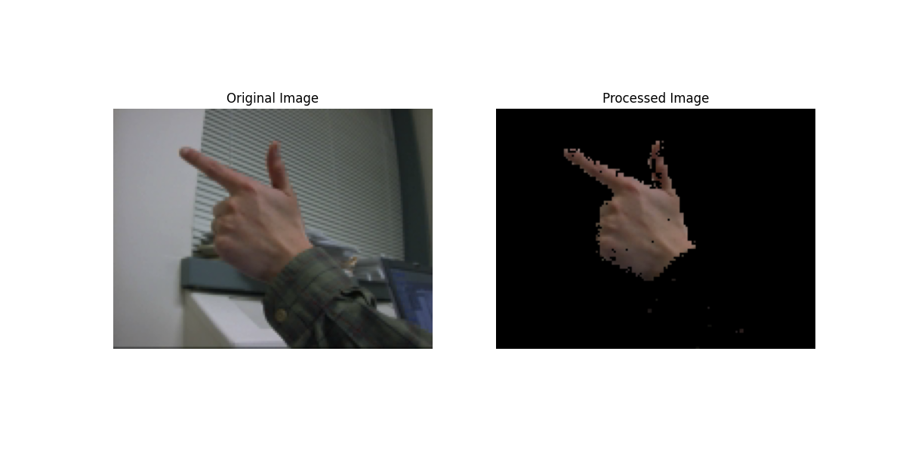
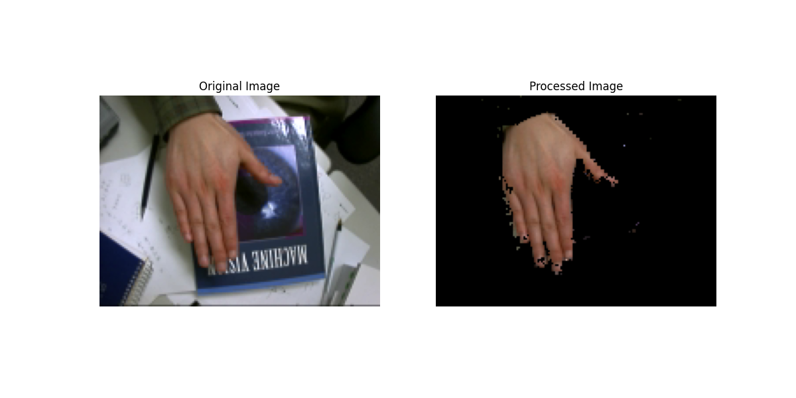
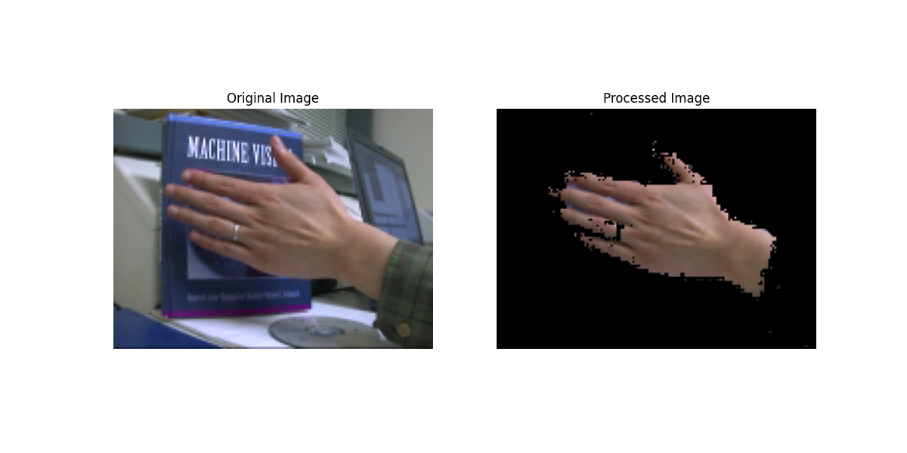

# Writeup for Histogram-based Skin Color Detection

## Overview

The objective of this assignment was to create a segmented image representing skin color. This was achieved by creating a training dataset of skin in various angles, generating a histogram distribution, normalizing it, and using that distribution as a mask over the real image to segment the skin color from the background.

## Packages Used
- NumPy: for numerical operations and array manipulation
- Matplotlib: for plotting histograms and displaying images
- OpenCV: For converting images to HSV

## Algorithm

The first step of the algorithm is to read training images as HSV files. Using these training images, it generates a 2D histogram with x-values as Hue and y-values as saturation, with the color bar representing the frequency of that HSV value. This histogram is then normalized with the provided data. The normalized histogram data is then used to mask the original image. For masking, the algorithm iterates over each pixel, checks the normalized histogram value for the pixel's hue and saturation value, and if it is less than the specified threshold, the pixel is turned black. This results in an image that only contains the foreground skin color.

The 2D histogram for the training looks as follows:

It can be seen that there is a region on the graph with higher frequency. Those Hue and Saturation values represent the trained skin color representation.

## Result

1. Finger Gun Image

2. Finger Joy Image

3. Finger Pointer Image

## Result Analysis

Looking at the images, it can be seen that the segmentation is done really well. This effectively removes noisy pixels if the threshold is set correctly. The images above confirm that only pixels representing the skin color are segmented, leading to very clean images. More and better skin images will lead to a more robust algorithm. I tested this by doubling my testing set, and it performed better with more images.