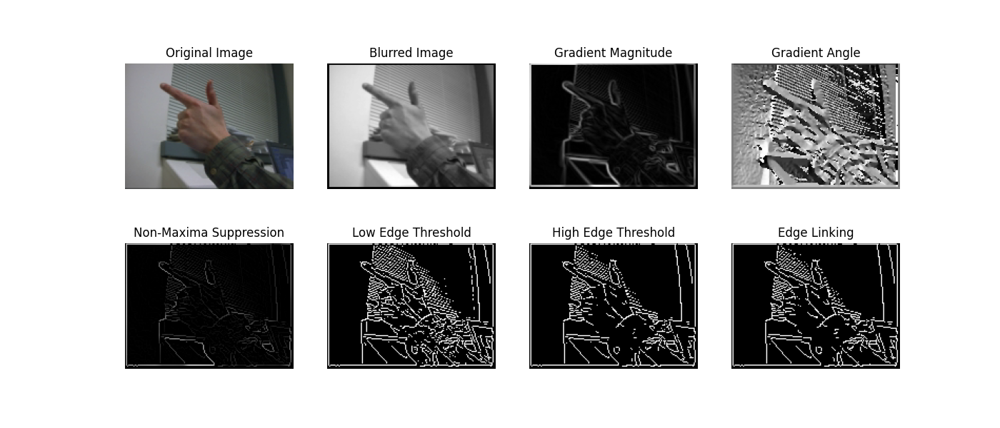
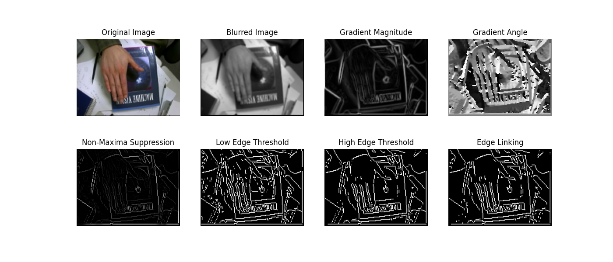
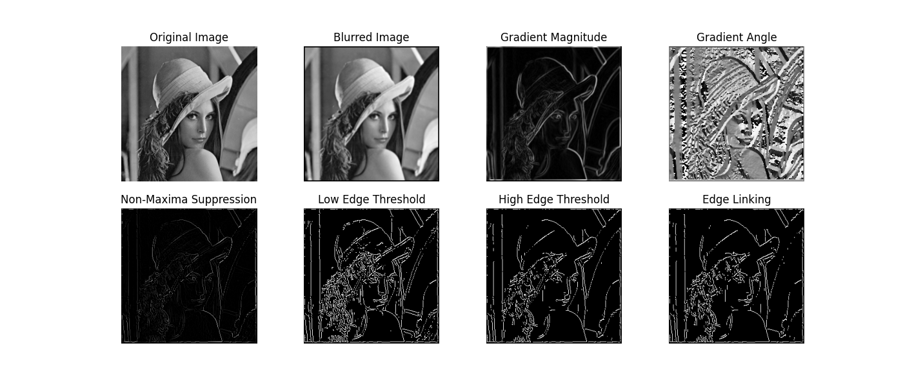
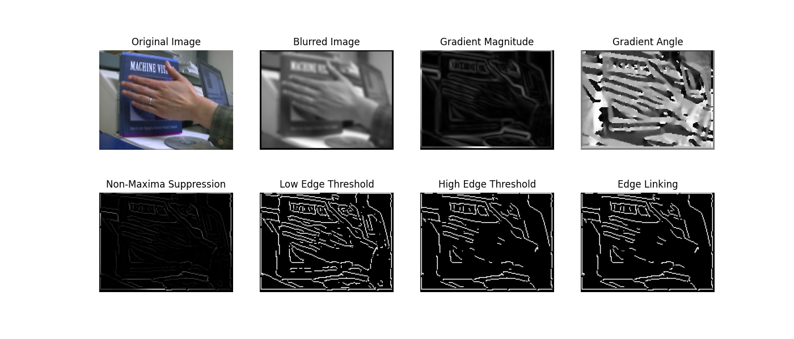
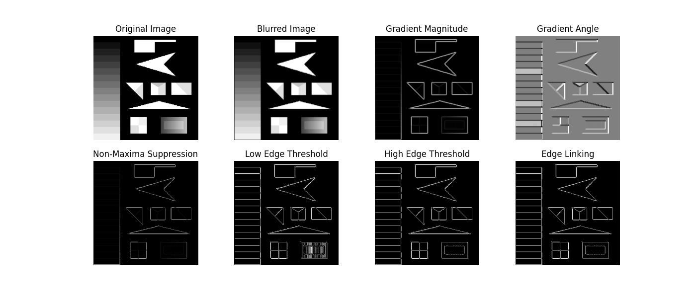
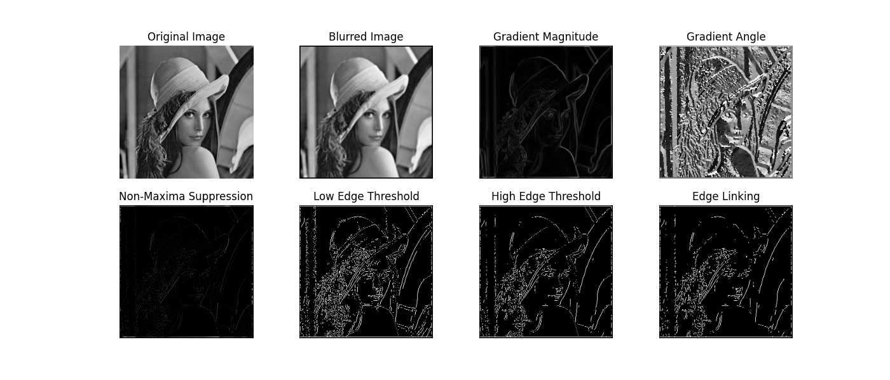
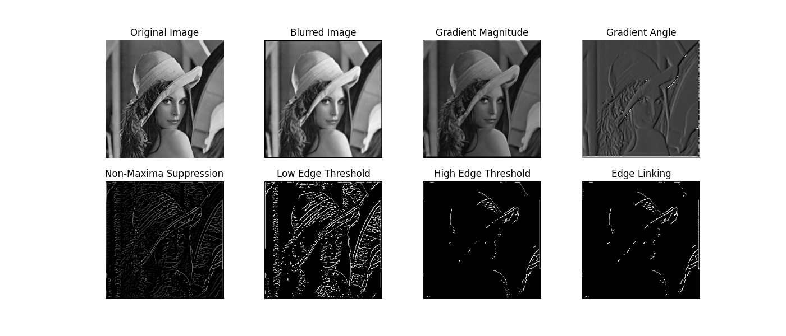

# Writeup -  Canny Edge Detection Algorithm

## Overview
Canny Edge Detection is a widely used image processing technique for detecting edges while suppressing noise. It comprises multiple stages, including Gaussian blurring, gradient calculation, thresholding, non-maxima suppression, and edge linking.

## Packages Used
- NumPy: Utilized for numerical operations and array manipulation.
- Matplotlib: Employed for plotting images and detected lines.

## Algorithms

### Gaussian Blurring
Gaussian blurring is a technique used to reduce noise and detail in images by convolving the image with a Gaussian kernel. The algorithm involves the following steps:

- Gaussian Kernel Generation: The first step is to generate a Gaussian kernel of a specified size and standard deviation (sigma). The size of the kernel determines the extent of blurring, while the sigma controls the spread of the Gaussian curve.
- Convolution: The generated Gaussian kernel is convolved with the input image. Convolution involves overlaying the Gaussian kernel on each pixel of the image and computing the weighted average of the neighboring pixels. This process smooths the image by reducing high-frequency components.

### Image Gradient
The image gradient calculation is a fundamental step in edge detection algorithms to find the intensity gradients and directions of the edges in the image. The algorithm involves the following steps:

- Sobel Operators: Sobel operators are used to approximate the gradient of the image intensity function. These operators consist of two 3x3 matrices (one for horizontal changes and one for vertical changes) that are convolved with the image. (Different Operators can be used but most used are Sobel)

- Rober Cross Operator - The Robert Cross operator, similar to Sobel, approximates the gradient of the image intensity. It utilizes two 2x2 matrices, to compute the horizontal and vertical gradients. These masks emphasize diagonal edges in the image.

- Prewitt Operator - The Prewitt operator is another method for gradient approximation. Like Sobel and Robert Cross operators, it employs convolution with masks to compute horizontal and vertical gradients. The Prewitt masks, also 3x3 matrices, are designed to detect edges in the image by emphasizing horizontal and vertical transitions.

- Gradient Magnitude and Angle Calculation: After applying Sobel operators, the gradient magnitude and angle are calculated for each pixel in the image. The gradient magnitude represents the rate of change of intensity, while the gradient angle indicates the direction of the steepest ascent in intensity.

### Thresholding
Thresholding is applied to the gradient magnitude to categorize pixels into edge and non-edge pixels. The algorithm involves the following steps:

- Histogram Calculation: A histogram of the gradient magnitude values is computed to analyze the distribution of pixel intensities.
- Cumulative Distribution: The cumulative distribution function (CDF) of the histogram is calculated to spread out the pixel intensity values.
- Threshold Selection: Threshold values are selected based on the desired percentage of non-edge pixels. These thresholds divide the gradient magnitude values into edge and non-edge regions. The low threshold value is choosen to be half of the high threshold value.

### Non-Maxima Suppression
Non-maxima suppression is performed to thin out the edges by suppressing all gradient values except the local maxima along the direction of the gradient. The algorithm involves the following steps:

- Edge Direction Determination: The gradient angles are used to determine the direction of each edge pixel.
- Local Maximum Detection: For each pixel, only the gradient magnitude is retained if it is a local maximum along the direction of the gradient.

### Edge Linking
Edge linking is carried out to connect neighboring pixels with strong edges to form continuous edges. The algorithm involves the following steps:

- Thresholding: Two threshold values are used to classify edge pixels as strong, weak, or non-edge pixels. These values are calculated in the  
- Edge Following: Starting from strong edge pixels, weak edge pixels that are connected to strong edge pixels are identified and added to the edge map.
- Edge Completion: The edge map is completed by tracing along the weak edges connected to strong edges, forming continuous edge contours.

## Result
The implemented Canny Edge Detection algorithm successfully detects edges in images while suppressing noise. By combining Gaussian blurring, gradient calculation, thresholding, non-maxima suppression, and edge linking, it provides clear and accurate edge maps suitable for various image processing applications.

1. Gun.png

Hyper Parameteres: Kernal size - 5, sigma = 0.5, percentageofNonEdge = 0.65

The result can be seen to have a lot of edges from the background blinds but can detect the hand really well

2. Joy.png

Hyper Parameteres: Kernal size - 3, sigma = 0.8, percentageofNonEdge = 0.5

The result reads a lot of edges from the book and  the triangular shape is detected really well. The hand is also detected well but it can be seen as some links are sharp enough and some data for the finger gets connected to the book edge

3. lena.png

Hyper Parameteres: Kernal size - 5, sigma = 0.8, percentageofNonEdge = 0.7

The lena image results in a a very good edge detection. The edges for each shape is very well defined. A very interesting part is to see the bunch of hair being detected as boundary which looks really cool

4. pointer.png

Hyper Parameteres: Kernal size - 5, sigma = 1.5, percentageofNonEdge = 0.56

This result is very similar to the other hand pictures. Some edges are really light and difficult to catch while some background edges are really sharp which turn into foreground. Here for the reult, the image shows boundary from the fingers but due to the percentage of the edge, it loses some details in thresholding.

5. test.png

Hyper Parameteres: Kernal size - 3, sigma = 20, percentageofNonEdge = 0.9

This image needed a lot of smoothing to remove the noise that was created from lie linking whiuch led to a high sigma. The high percentage of edge detection is also for the same reason as more smoothing does lead to loss of some boundaries and 0.9 increases the threshold to capture all of them

The three hyperparamters used are:

1. Kernel Size: Increasing and decreasing the kernel size will result in more pixels being used for convolution and all the functions. The same kernel size is used for smoothing. A higher kernel size during smoothing will involve more kernels convoluting simultaneously. Since the stride is one, as we go through each pixel, we will use more or less neighboring data for that pixel depending on the kernel size.

2. Sigma for Gaussian Kernel: A higher sigma value leads to higher blurring. This is because the Gaussian function for selecting the convolution kernel depends on sigma. Larger value of sigma leads to a wider gaussian distribution which leads to more blurring. 

3. Percentage of Non-Edge: This parameter is used to determine the thresholding value of the pixel density. Higher values result in higher pixel density, potentially leading to the removal of many edges. Lower values may include many weak boundaries. This parameter needs to be set based on the amount of information required from the image.

## Different Gradient Operators Discussion

The ImageGradient Function implements different operators. These are Robert Cross Prewitt and Sobel. For all the result imgages Sobel operator was used. Here is a discussion on how diffferent operators had different effect. TO do that I am using the lena.bmp with the same hyperparameters mentioned above.

- Robert Cross 

- Prewitt

Through these images it can be seen that the sobel output for edge detection was a lot cleaner than Robert Cross and Prewitt. 

The robert cross operator misses some sharp edges as due to a smaller convulutional size, it has a lot of very small edges which would be difficult to club together. 

The Prewitt operator has a stark difference in thresholded edges which lead to the edges not being completed. I also feel that the implementation requires a column wise search than a row wise pixel which might have also led to this result. 

## Result Analysis

Individual image analysis are under each image. Overall the canny edge detection works really well to extract edge details from the image. The image background plays a crucial part in edge detection and tuning the hyper paramaeters will lead to the desired image edge detection.
