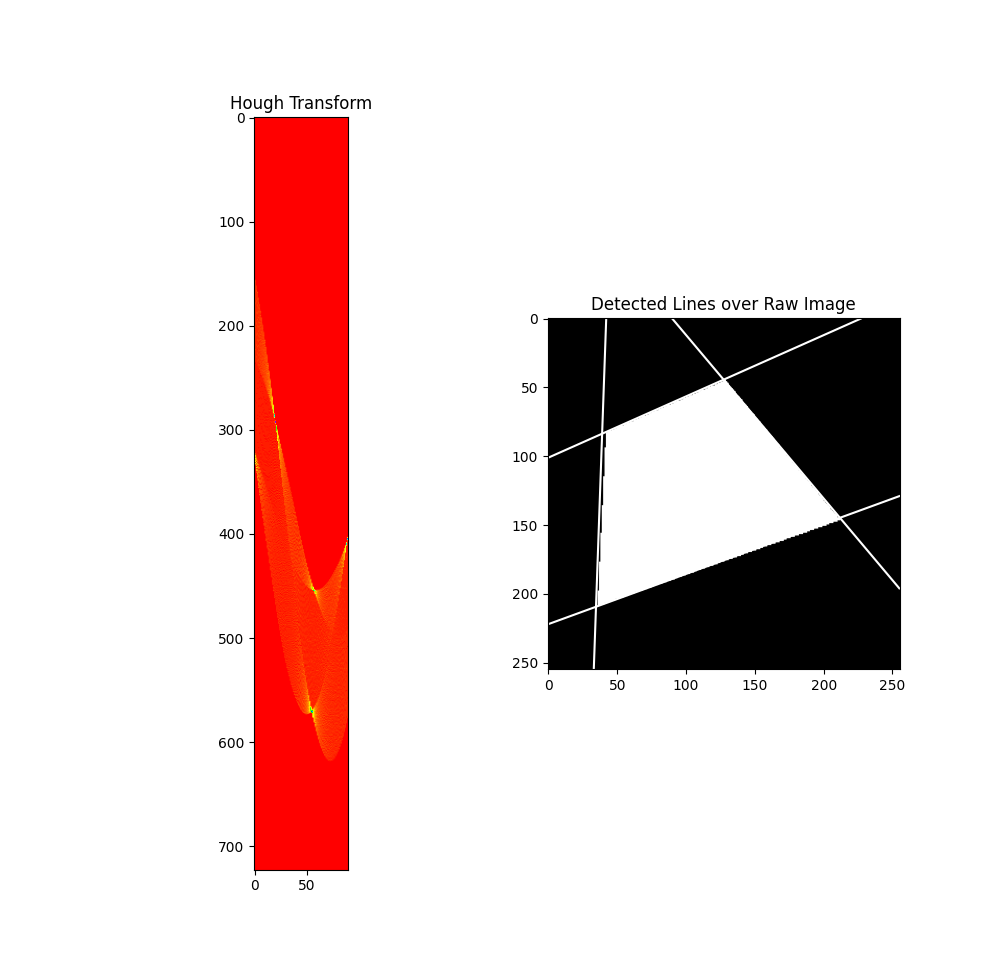
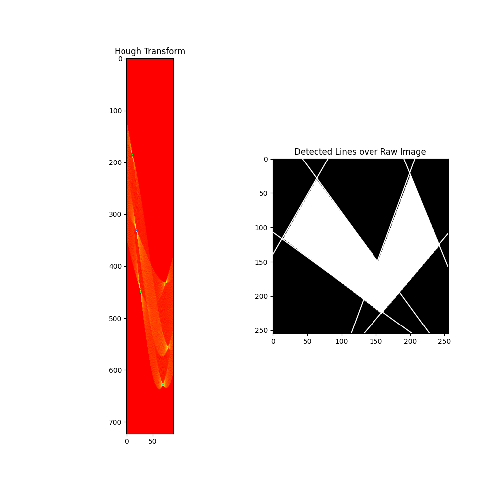
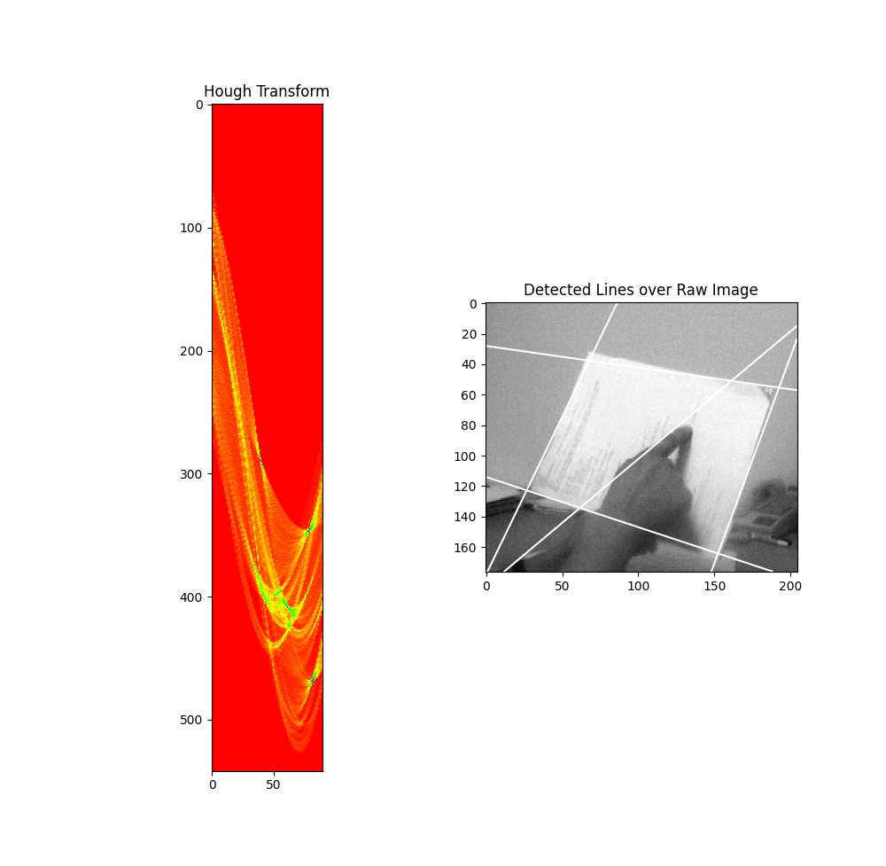

# Writeup for Hough Transform Line Detection

## Overview
This writeup discusses the implementation of Hough Transform for line detection in images. The Hough Transform is a popular technique used in computer vision to identify lines in an image by detecting significant intersections in parameter space.

## Packages Used
- NumPy: Utilized for numerical operations and array manipulation.
- Matplotlib: Employed for plotting images and detected lines.
- OpenCV: Utilized for reading images and performing edge detection using the Canny Edge Detection algorithm. (An implementation of Canny can be found in MP5 folder)

## Algorithms

### Hough Transform
The Hough Transform is applied to the edge image which is returned form the canny edge detection to detect lines. The algorithm involves the following steps:

- **Definition of Parameters**: Theta and rho parameters are defined to represent lines in the Hough parameter space. Theta represents the angle of the line, while rho represents the distance of the line from the origin. These are the polar coordinates of a line.

- **Accumulator Initialization**: An accumulator matrix is initialized to accumulate probability for potential lines in parameter space.

- **Edge Detection**: Edge detection is performed on the input image using the Canny Edge Detection algorithm, producing an edge image.

- **Edge Pixel Identification**: The indices of edge pixels in the edge image are obtained.

- **Hough Transform**: For each edge pixel, the corresponding theta and rho values are calculated and used to update the accumulator matrix by probability.

### Significant Intersection Extraction
Significant intersections are extracted from the accumulator matrix to identify lines in the image. The algorithm involves the following steps:

- **Thresholding**: Thresholding is applied to the accumulator matrix to identify significant intersections with high probability.

- **Intersections Filtering**: Intersections that are close to each other are filtered out to remove redundant detections.

- **Line Formation**: Each intersection point is then interpolated to lines by converting the polar coordinates of that intersection to an infinitely long line. This line is then clipped according the image size to just fit on the image. The cv2 function to show images usually takes care of it but the implementation here doesn't use it.  

## Result

The implemented Hough Transform algorithm successfully detects lines in the input image. Detected lines are visualized by overlaying them on the original image, providing a clear representation of the detected line segments.

### Comparison of Different Quantization in the Parameter Space
Different quantization levels in the parameter space (theta and rho) were tested to see what leads to a better line detection. Lower Resolution values lead to a smooth resolution which was visualised with a smooth parameter curve, while higher resolution values led to coarser resolution which was observed during testing in a blocky parameter space curve.

### Detection of Significant Intersections in the Parameter Space
An accumulator matrix was created with all the possible lines from the edge image. Then the whole matrix is passed through a threshold which is a hyperparameter which removes a lot of unnecessary lines and the ones with highest possibility are used. Another level of thresholding is done where if two lines are very close to each other, one of them is removed as they would be detecting the same thing. The plotted parameter curve shows the number of intersection points which can be detected. 

1. Test.bmp

Hyperparameters - rho_resolution: 2, theta_resolution: 1, threshold: 55

2. Test2.bmp

Hyperparameters - rho_resolution: 2, theta_resolution: 1, threshold: 55

3. Input.bmp

Hyperparameters - rho_resolution: 2, theta_resolution: 1, threshold: 55

## Result Analysis
From the images it can be seen that Hough line detection is very smooth and detects all the necessary edges. This is also compared with the result provided to us and matches all the hough lines to be detected. The rho and theta resolution were kept low to detect as many lines as possible and then remove them using thresholding.

The code has a lot of connected lines where I was implementing the Canny detection I created which worked really well for the test and test2 image but didn't perform well with the input.bmp image. This makes sense as the test images have hard defined boundaries which are easy to detect while the edge detection in a real image with noise is difficult which will lead to a lot of extra lines being created. 